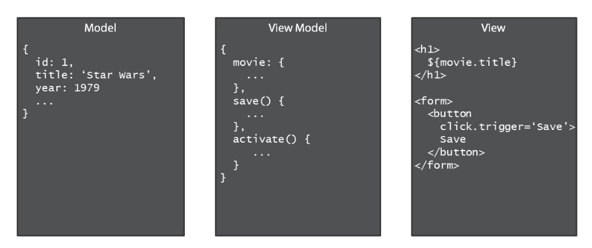

<!-- START doctoc generated TOC please keep comment here to allow auto update -->
<!-- DON'T EDIT THIS SECTION, INSTEAD RE-RUN doctoc TO UPDATE -->
**Table of Contents**  *generated with [DocToc](http://doctoc.herokuapp.com/)*

- [Building Applications with Aurelia](#building-applications-with-aurelia)
  - [Getting started with JSPM](#getting-started-with-jspm)
    - [config.js](#configjs)
    - [System.js](#systemjs)
  - [Getting started with Aurelia](#getting-started-with-aurelia)
    - [MVVM and Conventions](#mvvm-and-conventions)
    - [Summary of bootstrapping process](#summary-of-bootstrapping-process)
  - [Views and View Models](#views-and-view-models)
    - [Compose](#compose)
    - [Fetching Data](#fetching-data)
    - [Dependency Injection](#dependency-injection)
    - [Services](#services)
    - [UI](#ui)
  - [Configuration and routing](#configuration-and-routing)
  - [Data Binding](#data-binding)
  - [HTTP Client Configuration](#http-client-configuration)
  - [Client side validation](#client-side-validation)
  - [Custom Element](#custom-element)
  - [Production Bundling](#production-bundling)
  - [Further optimizations](#further-optimizations)

<!-- END doctoc generated TOC please keep comment here to allow auto update -->

# Building Applications with Aurelia

> My course notes from [Pluralsight course on Aurelia](https://app.pluralsight.com/library/courses/building-applications-aurelia/table-of-contents)

## Getting started with JSPM

JSPM is a package manager. It can be used to install packages and also configure itself (via entries in `config.js`) such that at runtime, the module loader will be able to locate these packages and make http requests to fetch js files.

To use it, start at root of project:

```shell
jspm init
```
* yes to create `package.json`, both npm and jspm use package.json to keep track of dependencies
* yes to prefix jspm properties in package.json
* enter path where static assets are served from, eg `public`
* accept default of `jspm_packages` folder under `public`, this is where jspm will install libraries
* yes to create `public/config.js`
* client base url can be `/`, i.e. what client would enter to get to the website
* yes to transpiler, babel

jspm is not just a package manager, but also serves up scripts that function as a run-time environment for application. These scripts can dynamically transpile js on the fly and dynamically load modules.

To kick it off, need to load two scripts in index.html:

* system.js itself, which was installed as part of jspm init
* config.js, which was generated as part of jspm init

### config.js

config.js contains the configuration information for the project, so that system.js can load the application and the libraries it requires. For the most part, jspm creates and maintains this file.

Generally don't need to manually edit this setting, except for some optional transpiler settings.

Provides the mapping between package names and locations on the file server.

### System.js

config.js is the configuration for _System.js_, which is a universal dynamic module loader. It understands how to load ES2015 modules, AMD, and CommonJS. Provides an API that is intended to be the future spec for loading modules natively in the browser.

Provides a standard global object `System`, which provides an api to import and load JavaScript modules.

The module loader is also capable of transpiling es2015 files on the fly to javascript, using the configured transpiler specified in config.js.

To tell System.js to load a module, for example to kick things off in index.html:

```html
<body>

  <script src="jspm_packages/system.js"></script>
  <script src="config.js"></script>
  <script>
    System.import('app');
  </script>
</body>
```

## Getting started with Aurelia

Aurelia is designed as multiple smaller modules rather than a single monolith.
For example, aurelia-framework contains the core framework, for data binding and templating,
aurelia-bootstrapper is for kickstarting an aurelia application.

First use jspm to install the framework:

```shell
jspm install aurelia-framework
jspm install aurelia-bootstrapper
```

To kick off the app from index.html:

```html
<body>

  <script src="jspm_packages/system.js"></script>
  <script src="config.js"></script>
  <script>
    System.import('aurelia-bootstrapper');
  </script>
</body>
```

Like many frameworks, Aurelia is going to take control, manage browser, history, routing, etc.
and will call into your application code, bootstrapper loads the application.

### MVVM and Conventions

By _convention_, the first thing the bootstrapper will do (if not given any other information), is to load the first _viewModel_ for the application, named "app".

Aurelia uses the Model-View-ViewModel design pattern to provide separation of concerns.

It will look for a viewModel for the application, and a corresponding view, and tie them together and load.

A viewModel is implemented as a class, simple example:

```javascript
export class App {

  constructor() {
    this.message = 'Hello from Aurelia!';
  }

  changeMessge() {
    this.message = 'foo';
  }

}
```

Also by convention, Aurelia will look for a view `app.html`, i.e. the same name as `app.js` but with html extension, and in the same directory as the viewModel.

Views are html _templates_, simple example with a binding expression from the view:

```html
<template>
  <div>${message}</div>
  <button click.trigger="changeMessage()">Click Me</button>
</template>
```

`click.trigger` is a binding expression that tells Aurelia when the user clicked the button, and will invoke the `changeMessage` method on the viewModel.

Finally, need to tell Aurelia where to load views in the DOM. This is specified with "aurelia-app" attribute in the index.html, for example:

```html
<body aurelia-app>
</body>
```

### Summary of bootstrapping process

* module loader loads aurelia-bootstrapper as specified by `System.import` in index.html
* aurelia-bootstrapper will look for `app.js` module
* aurelia-framework will construct an instance of the `app.js` viewModel, load the corresponding `app.html` view, tie the two together, and handle all the binding expressions in the view.
* if viewModel has an `activate()` method, Aurelia will call it before the view is rendered.

Note that application is written as just plain javascript and html, with a few special attributes and data binding expressions. No framework spepcific code to be found in viewModels.

## Views and View Models

Separation of concerns between Model, View Model and View, for example:



_Model_ data is fetched from an http service, which is then attached to a _View Model_, which is a model object specifically constructed for the responsibility of presenting data to the _View_, and handling behaviors associated with the view. For example, the View Model can contain logic associated with button click events.

The _View_ ideally has no logic. Contains only markup for UI and some simple binding expressions that glue the view to the view model.

In summary, the view has no logic, whereas the View Model has no knowledge of the presentation format.

### Compose

Compose is an Aurelia defined custom element. It tells Aurelia that a particular piece of the presentation should be delegated to another view model. Simple example, to load a component that will display the current date:

```html
<compose view-model="currentDate"></compose>
```

Aurelia will look for currentDate.js view model and currentDate.html view.

### Fetching Data

First install the http client. Note this is not a core Aurelia framework component, you could use any other http client module in its place.

```shell
jspm install aurelia-fetch-client
```

To use it in a view model, import it. Then for this simple example, instantiate it in constructor. Later will use dependency injection. Use it in activate method to return a promise:

```javascript
import {HttpClient} from 'aurelia-fetch-client';

export class App {

  constructor() {
    this.http = new HttpClient();
  }

  activate() {
    return this.http.fetch('http://localhost:3000/movies')
      .then(response => response.json())
      .then(movies => this.movies = movies);
  }

}
```

Now "movies" can be used in the view:

```html
<div class="movies-container">
  You have ${movies.length} movies.
  <table>
    <tr>
      <th>Title</th>
      <th>Release Year</th>
    </tr>
    <tr repeat.for="movie of movies">
      <td>${movie.title}</td>
      <td>${movie.releaseYear}</td>
    </tr>
  </table>
</div>
```

In addition to custom elements like Compose, Aurelia also provides some _custom attributes_ such as "repeat".
"repeat.for" can be used to loop through collection (eg: movies), and for each item, put it in a local variable (eg: movie), and stamp out the current dom element (the one which is using "repeat.for") and all its children for each item in the collection.

### Dependency Injection

To decouple view models from their direct dependencies. The core Aurelia framework provides an inversion of control container with _dependency injection_ features. The container is able to construct the view model and _pass in_ the dependencies it needs (such as http client) as constructor parameters. In this way, the view model does not need to instantiate its own dependencies, making it easier to unit test, where mock implementations of the dependencies can be passed in.

To allow Aurelia's DI container to inject the proper components, need to add some metadata to the view model class.

Can be done in ES2015 by adding static inject method to class. The DI container will look for this method to retrieve metadata about what needs to be injected, i.e. what components does this class need in order to be constructed.

The inject method returns an array (because there could be multiple constructor parameters) with the class names. The DI container will look up what to use for the particular symbol (in this case HttpClient), then create an instance of that object and inject it into the constructor.

```javascript
static inject() {
  return [HttpClient];
}
```

Another way to use DI is with _decorators_, part of ES2016 specification. A decorator can execute code against its target and modify it. The `inject` decorator from the Aurelia framework modifies the target class by adding in the metadata it needs. For example:

```javascript
import {inject} from 'aurelia-framework'

@inject(HttpClient)
export class App {

  constructor(httpClient) {
    this.http = httpClient;
  }

}
```

To use decorators, need to turn on es7 features in `config.js`:

```javascript
babelOptions: {
  "optional": [
    "runtime",
    "optimisation.modules.system",
    "es7.decorators"  // Add this
  ]
}
```

### Services

Can add your own custom modules for business logic, to abstract this away from the view model.
For example, a MovieService module to handle fetching movie data from the server. Custom modules can also make use of Aurelia's DI container in the same way a view model does. [Example](hello-aurelia/public/movie/movie-service.js)

Then in 'app.js', instead of importing aurelia-fetch-client, import the custom service and inject it. Note since its a local module, must specify the path:

```javascript
import {MovieService} from './movie/movie-service.js';
// other imports...

@inject(MovieService)
export class App {
  constructor(movieService) {
    this.movieService = movieService;
  }
  activate() {
    return this.movieService.fetchAll()
      .then(movies => this.movies = movies);
  }
}
```

By default, Aurelia's DI container treats the services and components that it instantiates as _singletons_.

The `@transient` decorator will change this and make a new instantiation each time that component is required.

### UI

Can use any css framework with Aurelia. For example, to use Bootstrap:

```shell
jspm install bootstrap
```

## Configuration and Routing

In the absence of any configuration, the bootstrapper module looks for the "app" view/view model pair and loads them. To take more control of the startup, provide a value for aurelia-app in the index.html, which is be the name of the module that will provide the configuration information:

```html
<body aurelia-app="main">
...
</body>
```

main.js should export a `configure` function because that's what the framework will look for and invoke as the bootstrapper is putting all the pieces together. [Example](movies-client/public/main.js)

When the framework invokes the configure function, its going to pass in the `aurelia` object, which exposes a fluent api to specify what should be used.

See [the docs](http://aurelia.io/docs.html#/aurelia/framework/1.0.0-beta.1.0.8/doc/article/app-configuration-and-startup) for more on startup configuration.

### Client Side Routing

The app view model can be considered the top level shell, or entry point, but in a large application, does not contain all the application features. Typically, app view and view model are only responsible for features common to entire application, such as navigation menu.

Specific features will be in separate view and view models. The app view can contain a placeholder, which is area in app view into which different features will appear as user navigates and interacts with the application.

Router will load specific view models when user visits certain urls. Router looks for custom element `<router-view>` as the placeholder into which to load and remove views as the url changes. The router also supports recursion via child routers (router within a router).

Recommend to organize project by feature. Create a directory per feature and put all related files together - view, view model, services etc.

By convention, if a view model exposes a `configureRouter()` method, Aurelia will automatically invoke it, and pass in `config` object where you can setup routing rules, and `router` which is an instance of the router itself. [Example](movies-client/public/app.js)

`router` object can be made part of view model, which makes view able to write binding expressions that use information in the router, for example, to display navigation links.

Full example:

```javascript
config.map([
  { route: ['', 'list'], moduleId: 'movie/list', title: 'List', nav: true},
  { route: 'about', moduleId: 'about/about', title: 'About', nav: true}
]);
```

If the url is `http://localhost:8080` or `http://localhost:8080/#/list`, then it will load the movie/list view and view model pair, and display 'List' as the page title.

Setting `nav: true` exposes a collection `router.navigation` that can be used with a `repeat.for` data binding in the view to display navigation links. Each object in this collection has an `href` property and `isActive`. Sample usage:

For example, note the use of string interpolation and ternary operator in the class attribute:

```html
<li repeat.for="row of router.navigation" class="${row.isActive ? 'active' : ''}">
  <a href.bind="row.href">${row.title}</a>
</li>
```

#### Configure Routes

Provide an array of routes, each being an object specifying the url and what to do when the url and route match.

For example, `{ route: 'details/:id', ...}` would match url `http://localhost:8080/#/details/3`

If `route` is an empty string, that matches application root, i.e. `http://localhost:8080/`,

`route` can also be an array indicating any of the strings should match, ` { route : ['', 'home'], ...}` means if url is root or `/#/home`, then that's a match.

#### Route Parameters

Start by defining a route, note the `name` parameter. This will be used to reference it in the `route-href` attribute in the view:

```javascript
{ route: 'detail/:id', moduleId: 'movie/detail', name: 'detail', title: 'Movie Detail'}
```

Then generate links in the list view that will navigate to a details view. Use Aurelia's custom `route-href` attribute that provides some information for Aurelia to feed to the router, to generate the url. First tell route-href which route you want to go to, and if it requires parameters, then pass them in using `params.bind`, which builds an object literal:

```html
<tr repeat.for="movie of movies">
  <td><a route-href="route: detail; params.bind: {id: movie.id}">${movie.title}</a></td>
</tr>
```

When Aurelia invokes a route with parameters, these will be passed in as a `params` object into the `activate` method of the view model. Continuing the example above with movie listing:

```javascript
export class Detail {
  ...
  activate(params) {
    // params.id is the movie id the detail route was invoked with
  }
}
```

Even if a route does not have parameters, it can be referenced by name in the view, for example:

```javascript
// inside configureRouter
{ route: ['', 'list'], moduleId: 'movie/list', name: 'home', title: 'List', nav: true},
// rest of routes...
```

```html
<a route-href="route: home">Back to list</a>
```

## Data Binding

`show.bind` hides and shows an element depending on truthiness of expression.

`if.bind` remove or add element from DOM depending on truthiness of expression.

`.bind` can be added to almost any element, for example to use inline styles

```html
<li style.bind="foo">some item</li>
```

String interpolation is done with `${bar}`

When using `.bind`, dollar sign and curly braces are not needed.

Bind syntax is a little cleaner, but string interpolation is useful when static content
needs to be mixed into the expression.

String interpolation is always one way, content moved from view-model into the view as a string.
Whereas `.bind` can be one or two way, Aurelia will pick a sensible default if you don't specify.

For example binding to a css class will be one way:

```html
<li repeat.for="row of router.navigation" class="${row.isActive ? 'active' : ''}">
  ...
</li>
```

But binding to an text input value will be two way by default, because Aurelia assumes
if user types into the input, that the value should be pushed back to the JavaScript object.

```html
<input type="text" value.bind="movie.title">
```

To wire up click handler, can use either `click.bind` or `click.delegate`.
Delegate is more flexible because it catches click events on the element AND any of its descendants.

```html
<button class="btn btn-primary" click.delegate="save()">
  Save
</button>
```

## HTTP Client Configuration

```javascript
import {HttpClient} from 'aurelia-http-client';

@inject(HttpClient)
export class SomeApi {

  let baseUrl = 'http://localhost:3000/movies';

  constructor(httpClient) {
    this.http = httpClient;
  }

  save(someObj) {
    var request = this.http.createRequest();
    request.asPut()
      .withUrl(baseUrl)
      .withHeader('Accept', 'application/json')
      .withHeader('Content-Type', 'application/json')
      .withContent(someObj)

    return request.send()
      .then(response => response.content);
  }
}
```

## Client side validation

Aurelia provides an optional module to perform client side validation. First install it:

```
jspm install aurelia-validation
```

Then configure it in `main.js`:

```
export function configure(aurelia) {
  aurelia.use
    .standardConfiguration()
    .developmentLogging()
    .plugin('aurelia-validation');

  aurelia.start().then(a => a.setRoot('app'));
}
```

## Custom Element

Add a view (html file with template tag) and viewModel.

Expose bindable properties with `@bindable` (requires enabling `es7.classProperties` in babel options in config.js).

```javascript
import {bindable} from 'aurelia-framework';

export class NavMenu {
  @bindable router = null;
}
```

Use the custom element in a view

```html
<template>
  <require from="./resources/nav-menu"></require>
  <nav-menu router.bind="router"></nav-menu>
  ... other view stuff here
</template>
```

Can also register a custom element in main.js so that it is globally available,
then don't have to use `<require>` to import it in each view that wishes to use it.

## Production Bundling

In development mode, each moduel is loaded via xhr, and ES6 -> ES5 is transpiled on the fly with Babel.

Use aurelia-cli and gulp to transpile, concat and minify all the javascript once at build time.

Install aurelia-cli globally and locally within project.

```
npm install aurelia-cli -g
npm install aurelia-cli --save-dev
```

An aurelia file is similar to a gulp or grunt file. It executes under node.js
and contains bundling instructions.

There are two kinds of bundles, `js` and `template`

Setting `inject: true` in js bundle options will inject the bundle into config.js.

So at runtime, the optimized bundle will be used, and no need to modify `index.html`.

```
aurelia bundle
aurelia unbundle
```

## Further optimizations

Install grunt-cli globally and grunt locally:

```
npm install gulp-cli -g
npm install gulp --save-dev
npm install gulp-uglify --save-dev
```
